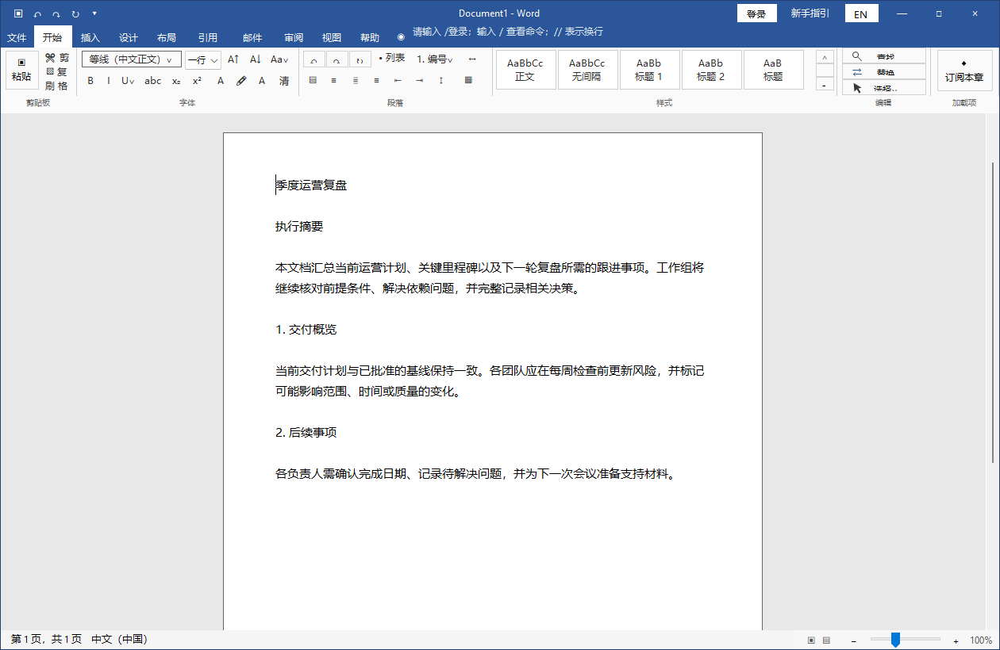
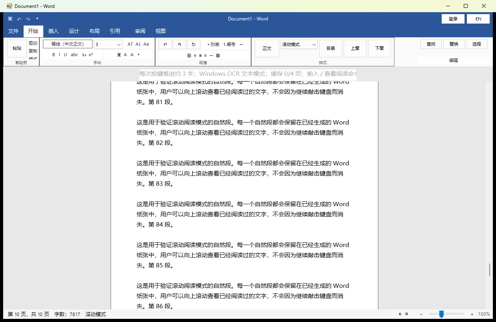
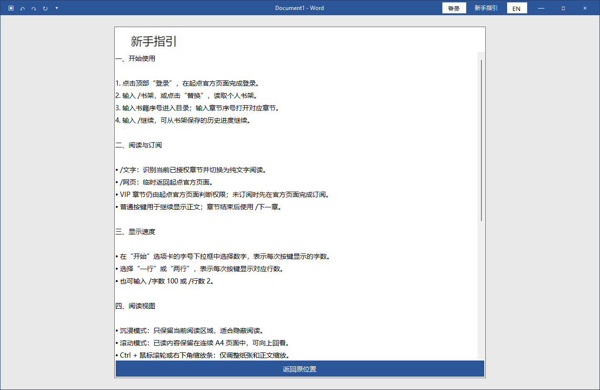
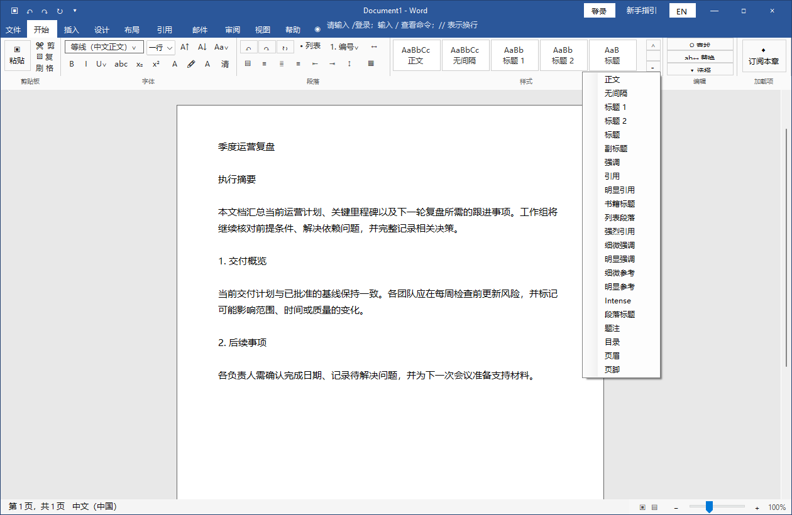

# WordReader

> 一个面向 Windows 的 Word 风格正版阅读客户端原型。登录、书架、目录、订阅与章节授权均由起点官方页面完成；正文仅对当前已授权、已显示的页面进行本地 OCR 识别。

<p align="center">
  
</p>

## 项目特点

- **Word 风格伪装**：蓝色标题栏、功能区、样式库、A4 纸张、状态栏与缩放控件。
- **正版账号流程**：通过内嵌 WebView2 完成登录、书架、目录、阅读和单章余额订阅。
- **完整目录聚合**：兼容延迟加载、章节分组与分页，使用统一的显示序号和真实章节映射。
- **本地 OCR 阅读**：优先使用 PP-OCRv6 Small，识别结果只保留在内存中；Windows OCR 自动兜底。
- **自然段与页面去重**：依据官方页面段落位置合并 OCR 块，并处理相邻截图的重复内容与页边截断。
- **双阅读模式**：沉浸模式逐步显示；滚动模式将已读文字排成连续 A4 页面，支持回看。
- **阅读预缓存**：后台预取最多四个后续视口，减少翻页等待。
- **中英双语**：界面默认中文，可随时切换英文。

## 界面预览

| Word 风格主界面 | 连续 A4 滚动阅读 |
| --- | --- |
|  |  |

| 新手指引 | 样式与阅读操作 |
| --- | --- |
|  |  |

## 应用商店功能图

<p align="center">
  
</p>

| 本地 OCR 纯文字阅读 | 沉浸与滚动双模式 |
| --- | --- |
|  |  |

| 完整目录与阅读缓存 | 命令、样式与新手指引 |
| --- | --- |
|  |  |

## 快速开始

### 运行环境

- Windows 10 / 11
- PowerShell 5+
- .NET Framework 4.6.2+
- Microsoft Edge WebView2 Runtime

### 构建与启动

```powershell
.\build.ps1
.\run.ps1
```

首次构建会从 NuGet 下载 Microsoft WebView2 SDK，并在 `bin\QuietReader.exe` 生成程序。

如需重新构建本地 PP-OCRv6 运行环境与校验模型：

```powershell
.\build-ocr.ps1
```

## 使用流程

首先找到最上方命令行（在顶部蓝色区域），随后键盘输入“/”发起命令，常用流程如下：
1. 输入 `/登录`，在起点官方页面完成登录。
2. 输入 `/书架`，读取当前账号书库。
3. 输入书籍序号，再输入章节序号；也可用 `/继续` 打开历史进度。
4. 直接敲击普通按键显示正文；在字号下拉框选择每次显示的字数、一行或两行。

<p align="center">
  
</p>

## 常用命令

| 命令 | 功能 |
| --- | --- |
| `/登录` | 打开官方登录页 |
| `/书架` | 返回并读取书架 |
| `/目录` | 返回当前书籍目录 |
| `/继续` | 从保存的阅读进度继续 |
| `/下一章` / `/上一章` | 切换章节 |
| `/订阅` | 确认后使用官方账号余额订阅当前章节 |
| `/文字` | 对当前授权页面重新进行本地 OCR |
| `/网页` | 返回起点官方渲染页面 |
| `/字数 100` | 每次按键显示约 100 个字 |
| `/行数 2` | 每次按键显示约 2 行 |
| `/滚动` / `/沉浸` | 切换阅读模式 |

输入 `/` 可打开命令候选，方向键选择，`Tab` 补全。普通输入中的 `//` 表示换行。

## 技术说明

- **桌面端**：C#、WinForms、.NET Framework
- **官方页面承载**：Microsoft Edge WebView2
- **正文识别**：PP-OCRv6 Small，Windows OCR 兜底
- **章节提取策略**：官方页面截图 + 可见 DOM 段落几何位置，不解密动态字体
- **缓存策略**：仅内存缓存当前章节附近视口，不导出、不持久化小说正文

起点章节页使用动态字体映射：浏览器画面中的汉字正常，但 DOM 与文本选择可能是替换后的 Unicode 码点，因此这不是 UTF-8/GBK 编码错误。项目不接入私有解密接口或第三方破解书源，而是在官方页面确认授权后识别当前可见内容。

## 安全边界

- 不绕过登录、VIP、订阅或访问控制。
- 不自动充值，不开启自动订阅；单章购买前必须本地确认。
- 不保存、批量下载或导出小说正文。
- 登录状态保存在当前用户的本地 WebView2 Profile 中。
- 本项目是个人实验性工具，与 Microsoft、Word、阅文集团或起点中文网无官方关联。
- 使用前请遵守目标网站服务条款、版权规则以及所在单位的设备使用政策。


## 项目结构

```text
QuietReader.cs                 主程序源码
build.ps1 / run.ps1           构建与启动脚本
build-ocr.ps1                 OCR 运行环境构建脚本
ocr-helper/                   本地 OCR 辅助程序
assets/screenshots/           README 实机截图
assets/posters/               宣传海报
tools/generate-posters.ps1    海报生成脚本
tools/generate-store-posters.ps1
                              应用商店功能图生成脚本
```
