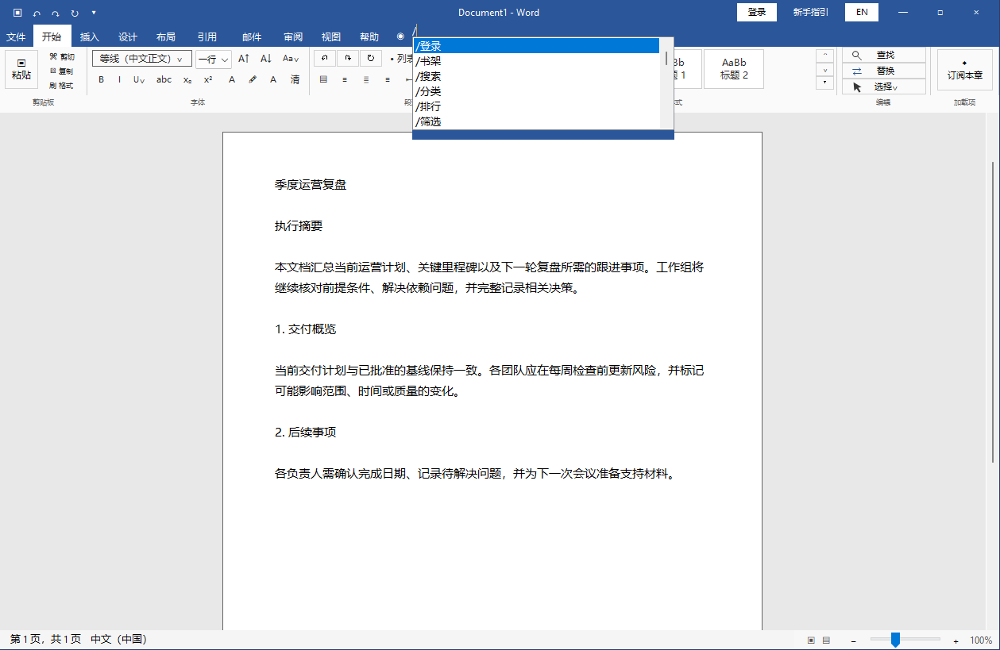

# WordReader 完整新手教程

> 本教程适用于 Windows 版 WordReader的新人用户，本页为傻瓜式教学，无需掌握代码基础，只要会打字即可。建议第一次使用时按顺序完成“启动 → 登录 → 书架或发现 → 目录 → 阅读”。

[返回项目首页](../README.md) · [下载最新版本](https://github.com/Sevenforweb/WordReader/releases/latest) · [查看常见问题](#十八常见问题)

## 教程目录

1. [30 秒快速开始](#一30-秒快速开始)
2. [下载、解压与启动](#二下载解压与启动)
3. [认识主界面](#三认识主界面)
4. [使用顶部命令行](#四使用顶部命令行)
5. [登录正版账号](#五登录正版账号)
6. [从书架开始阅读](#六从书架开始阅读)
7. [搜索、分类和排行榜找书](#七搜索分类和排行榜找书)
8. [书籍详情与应用内返回](#八书籍详情与应用内返回)
9. [查看完整目录并选择章节](#九查看完整目录并选择章节)
10. [敲击键盘显示正文](#十敲击键盘显示正文)
11. [调整每次显示的字数或行数](#十一调整每次显示的字数或行数)
12. [沉浸模式与滚动模式](#十二沉浸模式与滚动模式)
13. [OCR 识别、缓存与去重](#十三ocr-识别缓存与去重)
14. [上一章、下一章与返回导航](#十四上一章下一章与返回导航)
15. [VIP 章节安全订阅](#十五vip-章节安全订阅)
16. [新手指引与界面按钮](#十六新手指引与界面按钮)
17. [完整命令速查表](#十七完整命令速查表)
18. [常见问题](#十八常见问题)

## 一、30 秒快速开始

命令栏在顶部蓝色区域，有小字提示，是执行本软件所有操作的地方。输入命令可`鼠标选择`/`Tab`补齐，回车确定命令。
1. 双击项目根目录中的 `启动阅读器.cmd`程序（或`启动阅读器`，后缀隐藏了）。
2. 在顶部蓝色区域输入 `/登录`，或者点击右上角登录按键，根据操作指引完成起点官方账号登录。
3. 输入 `/书架`，等待书库显示为带序号的文字列表。或者可以输入`/`查看当前可用命令，进行分类/排行榜检索或名称搜索，下方会出现符合要求的书目，键盘直接敲击`N`翻到下一页，`P`回到上一页，具体提示会在当前页面以文字显示。
4. 根据出现的输入书籍序号，如果不在书架会进入详情页，显示书目详情数据，可进入目录或者直接开始阅读。目录页中，输入章节序号选择对应章节；也可以输入 `/继续`继续上一次的阅读进度。
5. 章节完成 OCR 后，直接敲击键盘上的普通按键显示正文。
6. 阅读中输入 `/下一章`、`/上一章`、`/目录` 或 `/返回` 进行导航。
如有不懂可用自行尝试，本软件操作简单，无需代码基础。

## 二、下载、解压与启动

### 方式 A：使用 GitHub Release

1. 打开 [WordReader Releases](https://github.com/Sevenforweb/WordReader/releases/latest)。
2. 下载 Windows x64 便携包并完整解压。
3. 确保 `bin`、`ocr-runtime`、`run.ps1` 等文件仍位于同一个项目目录中。
4. 双击 `启动阅读器.cmd`运行程序。

不要直接在压缩包预览窗口中运行程序，否则 OCR 模型、WebView2 依赖或登录目录可能无法正常访问。就正常解压使用即可。

### 方式 B：从源码构建

```powershell
.\build.ps1
.\run.ps1
```

需要重新构建完整 PP-OCRv6 环境时执行：

```powershell
.\build-ocr.ps1
```

### 系统要求

- Windows 10 或 Windows 11
- Microsoft Edge WebView2 Runtime
- PowerShell 5+
- 从源码构建时需要 .NET Framework 4.6.2+

## 三、认识主界面

下面是 WordReader 的真实运行界面：


界面主要分为五个区域：

1. **蓝色标题栏**：显示文档标题、登录、新手指引、中英文切换和窗口控制按钮。
2. **顶部命令位置**：位于蓝色区域中部，用于输入 `/登录`、`/书架`、`/目录` 等命令。
3. **Word 功能区**：保留字体、段落、样式、编辑等视觉结构，并将部分按钮替换为阅读功能。具体功能为：
4. **A4 文档区**：书架、目录、详情和 OCR 正文都会以文档文字形式显示。部分提示也会放在这一页。`Ctrl+滚轮`可切换A4纸展示大小。
5. **底部状态栏**：显示页数、字数、阅读模式和纸张缩放比例。

## 四、使用顶部命令行

### 打开命令候选

在顶部命令位置输入 `/`，程序会显示当前可用命令：



- 使用方向键选择候选命令。
- 按 `Tab` 快速补全。
- 按 `Enter` 执行命令。
- 输入 `/` 后也可以用鼠标选择候选项。
- 普通文字输入中的 `//` 表示插入一个换行。

### 命令不会破坏当前阅读状态

阅读时输入 `/` 会优先进入命令输入状态。执行 `/返回` 或关闭新手指引后，已经识别的正文、当前章节、显示进度和滚动位置会尽量保持不变。

## 五、登录正版账号

1. 输入 `/登录`。
2. 程序会临时显示起点官方登录页面。
3. 使用账号密码、扫码或微信等官方登录方式完成认证。`原理是用内置浏览器打开了官方页面，不会泄露隐私信息`
4. 第三方验证弹窗会在共享 WebView2 登录配置的内置窗口中打开。
5. 程序确认官方登录状态后，会返回 Word 风格文档页面。

### 登录注意事项

- 看到起点网页能够进入书架，才代表账号登录流程真正完成。现在默认会进入书架。
- 如果之前退出过账号或登录状态过期，需要重新执行 `/登录`或者右上角登录你自己的账号。
- 登录数据保存在当前 Windows 用户的本地 WebView2 Profile 中，不会写入 GitHub 仓库。
- WordReader 不读取或保存你的登录密码。

## 六、从书架开始阅读

1. 登录后输入 `/书架`。
2. 程序会访问起点官方书架，并将书籍整理成带序号的文字列表。
3. 输入书籍前面的序号，例如 `3`。
4. 程序读取该书完整目录，并标记历史进度和 VIP 章节。
5. 输入章节序号，或输入 `/继续` 从上次阅读位置开始。

书架读取期间，顶部会显示请求、页面加载、解析和已用时间。登录失效、安全验证、连接中断或页面结构变化都会显示明确提示，不会无限停留在“正在读取”。

## 七、搜索、分类和排行榜找书

WordReader 不要求必须先进入书架，也可以直接通过命令发现小说。

> 下图是功能流程示意；命令与列表结构对应当前程序能力。


### 搜索

```text
/搜索 书名或作者
```

搜索结果会显示为带序号的小说列表。输入序号可进入书籍详情。

### 分类

```text
/分类
/分类 玄幻
```

分类功能会依次读取起点官方页面提供的主分类、子分类、连载状态、字数、标签和排序条件。输入对应序号逐级选择。也可以直接在后面跟上你想要的类型，但必须是起点已有的分类。

### 排行榜

```text
/排行
/排行 月票
```

排行榜可以选择月票、畅销、阅读等榜单，并继续选择分类或时间范围。

### 列表与筛选控制

- `/筛选`：从小说列表回到当前待选择的下一层条件。
- `/排序`：打开人气、收藏、字数、推荐票或月票等排序项。
- `/结果`：暂停继续筛选，查看当前条件下的小说列表。
- `/返回`：撤销上一次筛选或回到进入当前页面前的位置。
- `N`：在发现列表中进入下一页。
- `P`：在发现列表中返回上一页。

程序会聚合官方发现列表的分页内容，并保持显示序号与实际书籍链接对应。

## 八、书籍详情与应用内返回

从书架、搜索、分类或排行榜选择一本书后，会进入文字版书籍详情。

> 下图是导航流程示意。


详情页可能显示：

- 书名和作者
- 分类与连载状态
- 字数和推荐信息
- 小说简介
- 最新章节与更新时间
- 是否已经加入书架

详情页常用命令：

- `/详情`：重新显示当前书籍详情。
- `/加入书架`：通过起点官方详情页加入个人书架。
- `/阅读`：尝试从官方进度或可阅读章节开始。
- `/目录`：打开完整章节列表。
- `/返回`：返回进入详情前的书架、发现列表或筛选页面。

应用内导航栈会记录“从哪里进入详情、目录和阅读”，因此 `/返回` 不只是简单刷新首页。

## 九、查看完整目录并选择章节

目录页会聚合起点官方目录中的章节分组、延迟加载和分页内容，然后统一编号。

- `[上次进度]`：表示账号记录的历史阅读位置。
- `[VIP]`：表示官方目录中带锁标记的付费章节。
- 输入章节序号：打开该序号对应的真实章节链接。
- `/继续`：从上次进度或当前章节继续。
- `/详情`：回到当前书籍详情。
- `/返回`：回到进入目录前的页面。

显示序号与内部章节索引采用同一套映射，输入第几章就应打开第几章，不再额外偏移。

## 十、敲击键盘显示正文

章节打开后，程序会先让起点官方页面完成授权和渲染，再对当前可见页面执行本地 OCR。

识别完成后：

1. 敲击普通字母、数字或标点按键。
2. 程序按照当前速度设置显示一部分正文。
3. 继续敲击即可继续显示。
4. 到达本章末尾后，普通按键不再继续增加文字。
5. 顶部会提示可以使用 `/下一章`。

打字只是阅读推进触发器，不会将你按下的字母写入小说正文。

## 十一、调整每次显示的字数或行数

### 使用 Word 字号下拉框

功能区中的字号选择框同时也是阅读速度选择器：

- 选择数字 `1`、`5`、`20` 等：每次按键显示大约对应数量的文字。
- 选择 `一行`：每次按键显示一行。
- 选择 `两行`：每次按键显示两行。

### 使用命令

```text
/字数 100
/行数 2
```

- `/字数 100`：每次按键推进约 100 个字符位置。
- `/行数 2`：每次按键推进约两行。

OCR 字符宽度、标点和段落换行会影响实际显示数量，因此“字数”是近似值。

## 十二、沉浸模式与滚动模式

### 沉浸模式

```text
/沉浸
```

- 使用单张 A4 页面跟随当前阅读位置。
- 适合只关注当前段落。
- 已经离开页面上方的内容不适合长距离回看。

### 滚动模式

```text
/滚动
```


- 已显示文字会保留在连续 A4 页面中。
- 一页写满后自动创建下一页。
- 视角会跟随最新生成的页面。
- 可以使用鼠标滚轮回到之前的页面查看上下文。

当前版本在滚动模式持续追加页面时，偶尔可能出现轻微视觉抖动，不影响已识别文字内容。

### 调整纸张缩放

- 按住 `Ctrl` 并滚动鼠标滚轮。
- 使用右下角缩放滑块。
- 点击状态栏中的 `-` 或 `+`。

缩放只改变纸张显示大小，不改变 OCR 识别字数或阅读进度。

## 十三、OCR 识别、缓存与去重

WordReader 当前优先使用 PP-OCRv6 Small，本地 Windows OCR 作为兜底。

### 为什么需要 OCR

起点阅读页可能使用动态字体映射：页面视觉汉字正确，但 DOM 中的字符并不是原始文字。修改 UTF-8、GBK 或网页编码不能恢复正文，因此程序识别官方页面已经渲染出的可见内容。

### 当前处理流程

1. 打开当前账号有权限访问的官方章节页。
2. 截取当前可见阅读视口。
3. 在本地运行 OCR。
4. 根据官方页面段落矩形恢复自然段。
5. 对相邻视口的重复内容进行模糊去重。
6. 预读取最多四个后续视口，减少下一页等待。

### OCR 相关命令

- `/文字`：重新识别当前已授权章节页面。
- `/网页`：返回起点官方渲染页面检查登录、订阅或页面状态。

正文识别结果只保存在当前运行内存中，不会被批量导出或提交到 GitHub。

## 十四、上一章、下一章与返回导航

- `/下一章`：打开官方页面提供的下一章链接。
- `/上一章`：打开上一章链接。
- `/目录`：返回当前书籍完整目录。
- `/详情`：返回当前书籍详情。
- `/书架`：离开当前书籍流程并读取个人书架。
- `/返回`：返回进入当前详情、目录或阅读流程前的页面。

章节切换后会重新执行官方权限检查和 OCR，不会把上一章的识别缓存误当成当前章节。

## 十五、VIP 章节安全订阅

> 下图是安全订阅流程示意。实际购买仍在起点官方页面中完成。


### 操作步骤

1. 打开带 `[VIP]` 标记且当前账号尚未购买的章节。
2. 输入 `/订阅`，或使用功能区中的订阅入口。
3. WordReader 打开起点官方当前章节订阅页面。
4. 核对章节、价格和余额。
5. 确认没有开启“自动订阅”，且范围只有当前一章。
6. 由你本人点击官方确认按钮。
7. 订阅完成后返回章节，再次输入 `/文字` 或 `/继续`。

### 安全限制

- 程序不会自动充值。
- 程序不会代替用户点击支付确认。
- 检测到自动订阅已勾选时，会要求先取消。
- 检测到批量订阅或多章范围时，会显示安全警告。
- 登录失效、余额不足、支付失败或安全验证会在顶部显示提示。
- 输入 `/返回` 可以退出订阅页面并恢复原章节。

## 十六、新手指引与界面按钮

点击标题栏中的“新手指引”可以打开内置说明：


关闭指引后，程序会恢复打开指引前的：

- 当前章节
- 已显示正文
- 打字推进位置
- 阅读模式
- 页面和滚动位置
- 当前目录或命令页面

因此可以在阅读途中随时查看帮助，而不必从章节开头重新开始。

## 十七、完整命令速查表

| 命令 | 作用 | 常用位置 |
| --- | --- | --- |
| `/登录` | 打开起点官方登录页 | 未登录或登录失效时 |
| `/书架` | 读取个人书库 | 任意命令页面 |
| `/搜索 关键词` | 搜索书名或作者 | 找新书 |
| `/分类` | 打开多级分类筛选 | 找新书 |
| `/分类 玄幻` | 从指定主分类开始 | 找新书 |
| `/排行` | 选择榜单 | 找新书 |
| `/排行 月票` | 直接进入指定榜单 | 找新书 |
| `/筛选` | 返回当前下一层筛选项 | 发现列表 |
| `/排序` | 打开排序选项 | 分类或发现列表 |
| `/结果` | 查看当前条件结果 | 筛选过程中 |
| `/详情` | 显示当前书籍详情 | 详情、目录或阅读流程 |
| `/加入书架` | 通过官方页面加入书架 | 书籍详情 |
| `/阅读` | 从详情进入可阅读章节 | 书籍详情 |
| `/目录` | 显示当前书籍完整目录 | 详情或阅读中 |
| `/继续` | 从保存进度或当前章节继续 | 目录或阅读中 |
| `/返回` | 返回进入当前流程前的页面 | 详情、目录、阅读、订阅 |
| `/下一章` | 打开下一章 | 阅读中 |
| `/上一章` | 打开上一章 | 阅读中 |
| `/订阅` | 打开官方单章订阅入口 | 未购买 VIP 章节 |
| `/文字` | 对当前授权页面重新 OCR | 阅读页 |
| `/网页` | 显示官方页面 | 排查登录、权限或渲染问题 |
| `/字数 100` | 设置每次按键显示字数 | 阅读中 |
| `/行数 2` | 设置每次按键显示行数 | 阅读中 |
| `/滚动` | 切换连续 A4 页面模式 | 阅读中 |
| `/沉浸` | 切换单页跟随模式 | 阅读中 |

发现小说列表中还可以直接按 `N` 下一页、按 `P` 上一页。

## 十八、常见问题

### 1. `/书架` 提示需要登录

重新执行 `/登录`。能看到普通起点页面不一定代表书架身份仍有效，应以官方书架能够实际打开为准。

### 2. 书架或发现列表一直显示正在读取

- 查看顶部最后阶段和已用时间。
- 检查网络是否能正常打开起点。
- 输入 `/网页` 查看是否出现官方安全验证。
- 关闭多余的 WordReader 实例，避免多个 WebView2 进程争用同一登录目录。

### 3. 目录显示不完整

等待程序完成章节分组、延迟加载和分页聚合。长目录处理时间会比普通网页打开稍长，但最终会统一编号。

### 4. 输入章节序号后打开了错误章节

请确认正在目录页而不是发现列表或书籍详情。当前版本使用显示序号与真实链接的一一映射；如果仍有偏移，请记录书名、目录总数和输入序号后提交 Issue。

### 5. OCR 只有简介，没有正文

通常表示打开的是书籍详情页而不是阅读页，或当前章节尚未取得阅读权限。输入 `/目录` 重新选择章节，或输入 `/网页` 检查官方页面状态。

### 6. OCR 有错字

- 等待页面字体和正文完全渲染后输入 `/文字` 重试。
- 确保纸张没有被其他窗口遮挡。
- PP-OCRv6 模型缺失时，程序会使用 Windows OCR，准确率可能不同。
- 动态字体、标点、低对比度和截断行仍可能导致少量识别错误。

### 7. 上下两页出现重复文字

程序会根据 DOM 段落索引和模糊前后缀进行去重。如果少量内容仍重复，可以输入 `/文字` 重新建立当前章节缓存。

### 8. 下一页等待时间较长

WordReader 会预缓存最多四个后续视口，但起点页面延迟渲染、网络波动或 OCR 首次加载仍可能造成等待。顶部缓存计数会显示当前进度。

### 9. VIP 章节仍然无法阅读

输入 `/网页` 检查官方页面是否显示订阅成功。订阅、余额、登录和安全验证状态全部由起点官方页面决定。

### 10. 双击启动文件没有反应

- 确认项目已完整解压。
- 检查 Windows 是否拦截未知程序或脚本。
- 安装 Microsoft Edge WebView2 Runtime。
- 在 PowerShell 中运行 `.\run.ps1` 查看错误信息。

## 数据与权限说明

- 登录、书架、目录、阅读和订阅操作均在起点官方页面与当前账号权限内进行。
- WordReader 不绕过 VIP、订阅或登录限制。
- OCR 只处理当前已授权并已经显示的页面。
- 小说正文不会批量下载、持久化或提交到项目仓库。
- 使用本项目时，请遵守目标网站服务条款、版权规则及所在单位设备政策。

---

[返回项目首页](../README.md) · [下载最新版本](https://github.com/Sevenforweb/WordReader/releases/latest)
